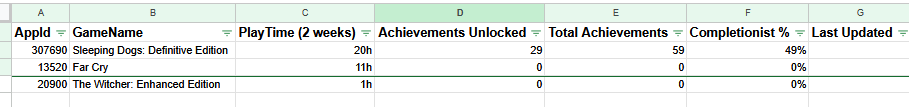
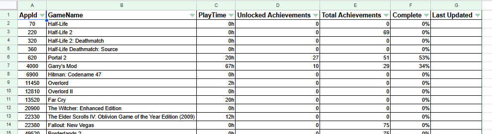
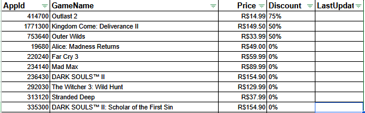

# SteamTracker
A Spring Boot application that aggregates game libraries, achievements, wishlists, and pricing information into a centralized dashboard.

SteamTracker is a multi-platform game tracking application focused on bringing all your gaming data into a single place.

The project aims to centralize game libraries, achievement progress, wishlist items, playtime statistics, and pricing information, making it easier to track your gaming activity across different platforms.

## Features

* Synchronize owned games
* Track achievement progress and completion percentage
* Monitor recently played games
* Synchronize wishlist items
* Track game prices and discounts
* Display information through a Google Sheets dashboard
* Scheduled automatic synchronization

## Architecture

The application follows a layered architecture:

```text
Scheduler
    ↓
Services
    ↓
Providers
    ↓
Clients
    ↓
External APIs
```

### Providers

* LibraryProvider
* AchievementProvider
* WishlistProvider
* PriceProvider

This architecture allows future support for multiple gaming platforms without major changes to the service layer.

## Technologies

* Java 17
* Spring Boot
* Steam Web API
* Google Sheets API
* Maven
* Jackson
* SLF4J

## Current Integrations

### Steam

* Owned Games
* Recently Played Games
* Achievement Tracking
* Wishlist Tracking
* Price Monitoring

### Google Sheets

* Dashboard Visualization
* Data Persistence

## Dashboard Preview

### Recently Played Games



### Owned Games



### Wishlist



## Roadmap

* [x] Steam Library Synchronization
* [x] Achievement Tracking
* [x] Wishlist Synchronization
* [x] Price Monitoring
* [x] Provider-Based Architecture
* [ ] IsThereAnyDeal Integration
* [ ] GOG Support
* [ ] Xbox Support
* [ ] Database Integration
* [ ] Web Dashboard

## Status

🚧 Active Development

SteamTracker is currently being developed as a personal project focused on learning software architecture, API integrations, and multi-platform game tracking.

