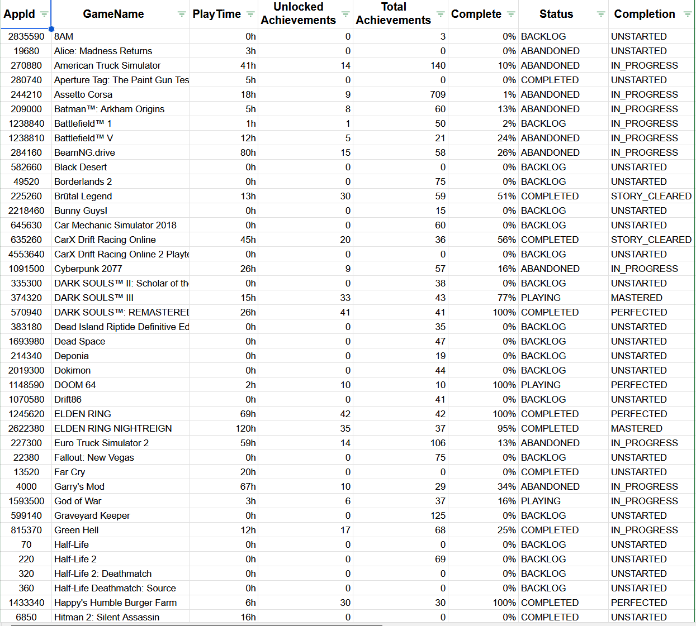
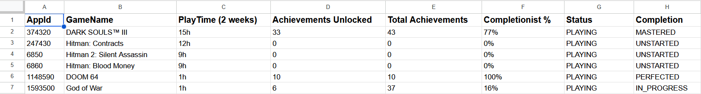
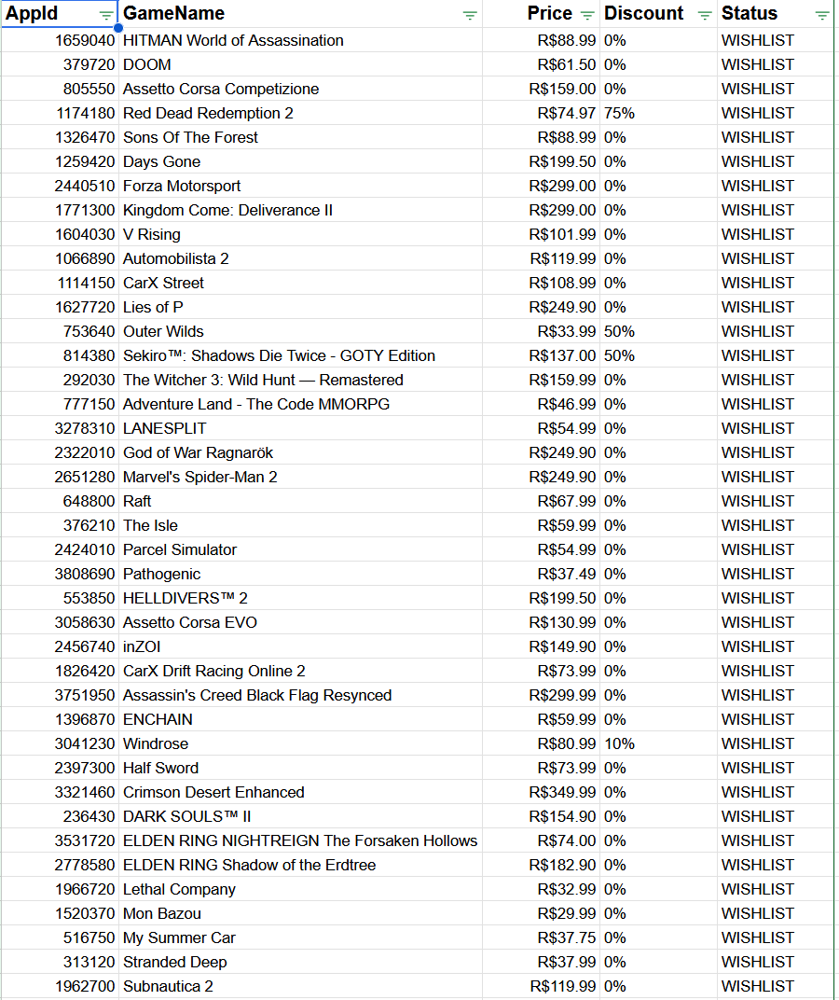
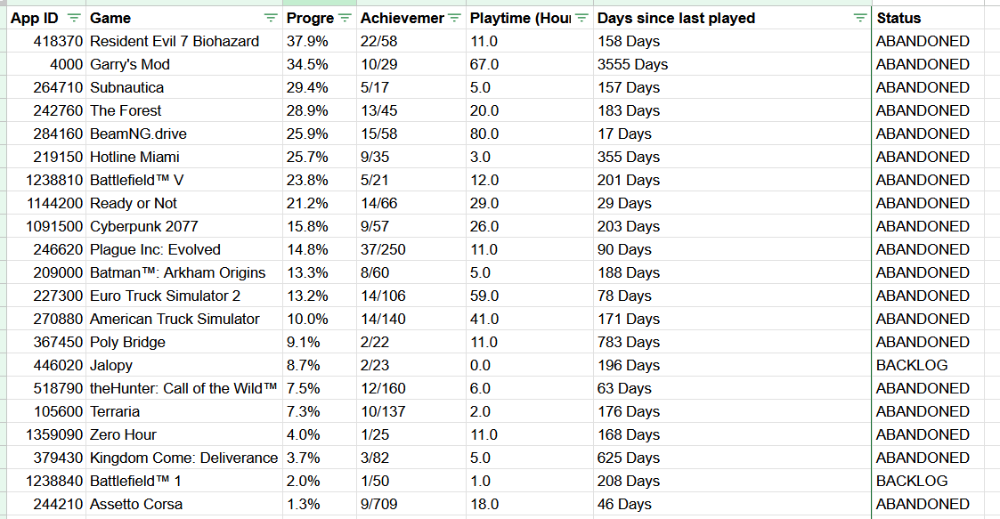
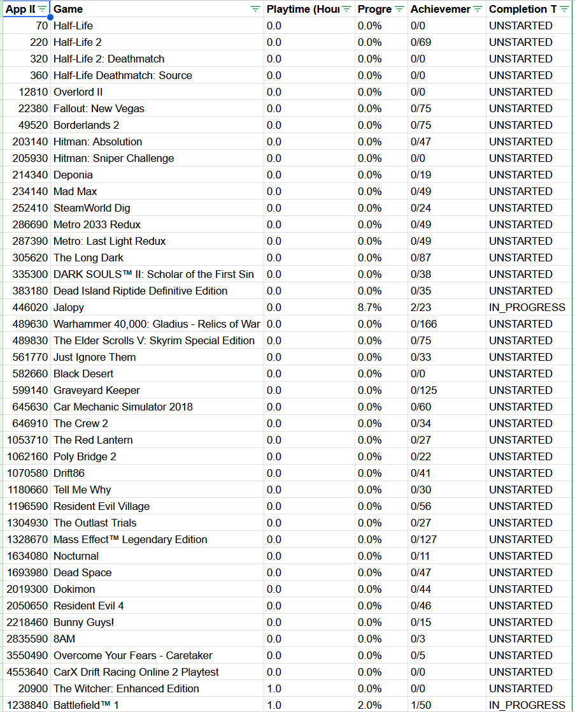
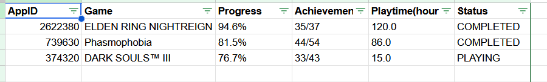
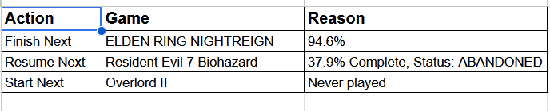
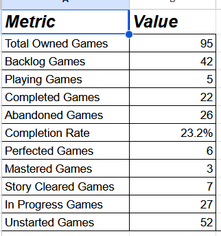

# SteamTracker
SteamTracker is a Java and Spring Boot application that transforms a Steam game library into a centralized gaming dashboard. It synchronizes owned games, achievements, playtime, recently played titles, wishlist items, and pricing information with Google Sheets.

Beyond data synchronization, SteamTracker includes an automatic game classification system, achievement completion tiers, gaming statistics, and recommendation services designed to help players manage their backlogs, resume unfinished games, and identify titles nearing completion.

## Features

### Game Library Management
* Synchronize owned games and recently played titles.
* Track lifetime and recent playtime.
* Retrieve achievement progress and completion percentages.
* Synchronize Steam wishlist items.
* Monitor game prices and discounts.
* Exclude selected games from library analysis and recommendations.
* Override automatically assigned game statuses.

### Overview of Capabilities 
* Automatically classify games according to playtime, recent activity, and achievement progress.
* Assign achievement completion tiers.
* Generate library statistics and completion rates.
* Recommend games to start, resume, or finish.
* Synchronize dashboard data through scheduled background jobs.

## Gaming Classification

### Automatic Game Status

SteamTracker classifies owned games into the following statuses:

| **STATUS**      | **DESCRIPTION**                                                                                              |
|-----------------|--------------------------------------------------------------------------------------------------------------|
| **_BACKLOG_**   | Games with minimal recorded playtime that have not been meaningfully started.                                |
| **_PLAYING_**   | Games identified as recently played.                                                                         |
| **_COMPLETED_** | Games that have reached a qualifying achievement completion tier.                                            |
| **_ABANDONED_** | Games with recorded playtime that are not recently played and have not reached a qualifying completion tier. |

Automatic classifications can be overridden manually through the Google Sheets status configuration.

## Achievement Completion Tiers

Achievement progress is translated into **_Completion Tiers_**

| **ACHIEVEMENT PROGRESS**       | **TIER**            |
|--------------------------------|---------------------|
| 0%                             | **_UNSTARTED_**     |
| Greater than 0% and below 40%  | **_IN_PROGRESS_**   |
| 40% to below 75%               | **_STORY_CLEARED_** |
| 75% to below 100%              | **_MASTERED_**      |
| 100%                           | **_PERFECTED_**     |

These tiers provide a consistent way to analyze achievement progress independently of the automatic game status.

## Gaming Advisor

SteamTracker includes recommendation services that analyze the game library and help players decide what to play next.

## Backlog Assistant
Identifies games classified as BACKLOG and prioritizes titles with the lowest recorded lifetime playtime.

## Near-Completion Recommendations

Identifies games in the MASTERED completion tier and prioritizes those with the highest achievement completion percentage.

## Resume Assistant

Identifies partially completed games classified as ABANDONED or BACKLOG. Games with higher achievement completion percentages receive priority.

## Unified Gaming Advisor
Combines the recommendation services into three suggestions:

* **Finish Next** — A game approaching full achievement completion.
* **Resume Next** — A partially completed game worth returning to.
* **Start Next** — A backlog game with minimal recorded playtime.

Recommendations exclude games manually excluded from analysis.

## Gaming Statistics

SteamTracker generates statistics from the included game library, including:

* Total owned games.
* Games by automatic status.
* Games by achievement completion tiers.
* Overall library completion rate.

The completion rate is calculated as:

**Completed Games / Total Included Games × 100**

Games excluded from analysis are not included in these statistics.

## Architecture

SteamTracker follows a layered, provider-based architecture that separates external integrations, platform-specific implementations, business logic, and scheduled synchronization.

```text
SteamScheduler
      |
      v
Sheet Synchronization Services
      |
      v
Business Services
      |
      v
Provider Interfaces
      |
      v
Steam Providers
      |
      v
External API Clients
      |
      +---- Steam Web API
      +---- Steam Store API
      +---- Google Sheets API
```

## Core Components

| **COMPONENT**   | **RESPONSIBILITY**                                                                         |
|-----------------|--------------------------------------------------------------------------------------------|
| scheduler       | Triggers scheduled synchronization jobs.                                                   |
| services        | Implements library classification, statistics, recommendations, and synchronization logic. |
| services.sheet  | Formats and synchronizes gaming data with Google Sheets.                                   |
| providers       | Defines abstractions for library, achievement, wishlist, and pricing integrations.         |
| providers.steam | Provides Steam-specific implementations.                                                   |
| clients         | Communicates with Steam and Google Sheets APIs.                                            |
| entities        | Represents domain concepts such as games, achievements, library entries, and price offers. |
| models          | Represents data used for pricing, statistics, recommendations, and wishlist processing.    |
| mappers         | Converts external game data into application domain models.                                |
| enums           | Defines game statuses, completion tiers, and supported platform identifiers.               |

The provider abstractions are intended to make future platform integrations easier without coupling the business services directly to a single platform's API.

## Technologies

* Language: Java 17
* Framework: Spring Boot 4.0.6
* Build Tool: Maven
* External APIs: Steam Web API, Steam Store API, Google Sheets API
* Authentication: Google Auth Library
* JSON Processing: Jackson
* Utilities: Lombok, dotenv-java
* Logging: SLF4J

## Integrations

### Steam
Current integrations cover:

* Owned Games
* Recently Played Games
* Player achievement progress
* Wishlist synchronization
* Game information and pricing

### Google Sheets
Google Sheets acts as the dashboard and current data synchronization layer.

The application maintains separate synchronization services for library data, statistics, and gaming recommendations. It also reads configuration data for game exclusions and manual status overrides.

Google Sheets is currently used instead of a dedicated application database.

## Scheduled Synchronization
SteamTracker runs background jobs using Spring's scheduling support.

The current scheduler includes jobs for:

| **JOB**                   | **PURPOSE**                                          |
|---------------------------|------------------------------------------------------|
| **Owned Games**           | Synchronizes the Steam library.                      |
| **Recently played games** | Updates recent activity information.                 |
| **Wishlist**              | Synchronizes wishlist data and pricing information.  |
| **Gaming statistics**     | Updates aggregate library statistics.                |
| **Near completion**       | Updates near-completion recommendations.             |
| **Backlog Assistant**     | Updates backlog recommendations.                     |
| **Resume Assistant**      | Updates resume recommendations.                      |
| **Gaming Advisor**        | updates the unified gaming recommendations.          |

Cron expressions are configurable through Spring application properties. Scheduled jobs use the America/Sao_Paulo time zone.

The default configuration runs library synchronization and gaming statistics daily, refreshes recent activity hourly, synchronizes the wishlist every two hours, and refreshes gaming recommendations weekly.

## Motivation

SteamTracker started as a personal project to consolidate gaming information from different platforms into a single location.

The long-term goal is to provide a unified gaming hub capable of tracking libraries, achievements, wishlist items, playtime statistics, and pricing information across multiple gaming ecosystems.

## Dashboard Preview

SteamTracker uses Google Sheets as an interactive dashboard for exploring game libraries, monitoring achievement progress, reviewing personalized game recommendations, and analyzing gaming statistics.

## Library

### Owned Games



### Recently Played Games



### Wishlist



## Recommendations

### Resume Assistant 


### Backlog Assistant


### Near Completion Assistant



### Gaming Advisor



## Analytics

### Gaming Statistics 



## Setup

### Prerequisites

* A compatible Java Development Kit.
* Maven, or the project's Maven Wrapper if included.
* A Steam Web API key.
* A Steam ID.
* A Google Cloud project with the Google Sheets API enabled.
* A Google Service Account with access to the target spreadsheet.

### Configuration

Create the following environment variables:

```properties
STEAM_API_KEY=<your-steam-api-key>
STEAM_ID=<your-steam-id>
SPREADSHEET_ID=<your-google-sheet-id>
```

**Security Notice**: Never commit API keys, service account credentials, or other sensitive information to version control. Configure the required environment variables locally and keep credential files excluded from Git.

### Required Files

The application requires a Google Service Account credentials JSON file.

The credentials file is intentionally excluded from version control and must be created manually following the Google Sheets Credentials section.

### Google Sheets Credentials
The current implementation loads Google Service Account credentials from a JSON file under the user's home directory.

Configure the credentials file path expected by SheetsClient.java, or update the client to use an externally configurable path.

1. Create a Google Cloud project.
2. Enable the Google Sheets API.
3. Create a Service Account.
4. Download its credentials JSON file.
5. Place the file at the configured credentials location.
6. Share the target spreadsheet with the Service Account email address.

### Running the Application

Clone the repository:

```bash
git clone https://github.com/LucasPrette/SteamTracker.git
cd SteamTracker
```

Run using the Maven Wrapper if included:

```bash
./mvnw spring-boot:run
```
## On Windows
```bash
.\mvnw.cmd spring-boot:run
```

Alternatively, use an installed Maven distribution:

```bash
mvn spring-boot:run
```

### Local Development

The application includes application-local.properties, which overrides synchronization intervals for development.

The current local configuration uses frequent cron schedules to facilitate testing. Review these schedules before running the application, since several jobs may execute every second.

Activate the local Spring profile with:

```bash
mvn spring-boot:run -Dspring-boot.run.profiles=local
```
Ensure the required environment variables and Google credentials are configured before starting the application.

## Deployment

SteamTracker is designed to run continuously as a background service.

Typical deployment options:

* Linux server
* VPS
* Home server
* Docker container (planned)

## Supported Platforms

| PLATFORM | LIBRARY  | ACHIEVEMENTS | WISHLIST | PRICES  |
|----------|----------|--------------|----------|---------|
| STEAM    | ✅        | ✅            | ✅        | ✅       |
| GOG      | Planned  | Planned      | Planned  | Planned |
| XBOX     | Planned  | Planned      | Planned  | Planned |

## Roadmap

### Implemented
- [x] Steam Library Synchronization
- [x] Recently Played Games Tracking
- [x] Achievement Tracking
- [x] Wishlist Synchronization
- [x] Game Price and Discount Monitoring
- [x] Provider-Based Architecture
- [x] Domain Models and Mapper Layer
- [x] Automatic Game Status Classification
- [x] Achievement Completion Tier Classification
- [x] Manual Game Status Overrides
- [x] Manual Game Exclusion
- [x] Gaming Statistics Generation
- [x] Backlog Assistant
- [x] Near-Completion Recommendations
- [x] Resume Assistant
- [x] Unified Gaming Advisor
- [x] Scheduled Dashboard Synchronization
- [x] Batch Wishlist Updates
- [x] Cached Google Sheets Lookups
- [x] Steam API Retry and Error Handling
- [x] Synchronization Lifecycle Logging

### Planned

- [ ] IsThereAnyDeal Integration
- [ ] GOG Support
- [ ] Xbox Support
- [ ] Database Integration
- [ ] Web Dashboard
- [ ] Docker Deployment

## Project Status

🚧 Active Development

SteamTracker is a personal software engineering project focused on game library management, external API integration, provider-based architecture, scheduled processing, and personalized gaming recommendations.

Future development may include additional platform integrations, dedicated database persistence, and a web-based dashboard.